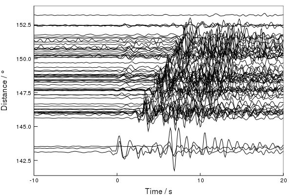

# SeisTau.jl

## Using

SeisTau integrates the [TauPy](https://github.com/anowacki/TauPy.jl) and
[Seis](ttps://github.com/anowacki/Seis.jl) packages, allowing one to easily
use seismic travel time predictions for 1D Earth models with `Seis.Trace`s.

SeisTau extends `Seis.add_picks!` so that you can add picks to your `Trace`s
like so:

```julia
julia> using Seis, SeisTau

julia> t = sample_data(:array);

julia> add_picks!.(t, "PKIKP")
60-element Array{Seis.SeisDict{Union{Int64, Symbol},NamedTuple{(:time, :name),Tuple{Float32,Union{Missing, String}}}},1}:
 Seis.SeisDict(:A=>Seis.Pick{Float32,String}((time=1134.08, name="A")),:PKIKP=>Seis.Pick{Float32,String}((time=1126.4486, name="PKIKP")),1=>Seis.Pick{Float32,String}((time=137.35, name=missing)))
...
```

Here we have added a pick for the
[PKIKP](https://www.ldeo.columbia.edu/res/pi/Monitoring/Doc/Srr_2006/GUIDE.PDF)
phase to all of the traces at once using Julia's `.`-notation, broadcasting the call to
`add_picks!` across each of the `Trace`s in `t`.

You can now plot up the data aligned on this pick:

```julia
julia> using Plots, Seis.Plot

julia> section(t, align="PKIKP", xlim=(-10,20), zoom=2)
```



See `Seis.picks` for more information on access picks in Seis.


## Installation

First, [install Seis.jl](https://github.com/anowacki/Seis.jl#installation).

Then, having chosen [one of the options below](#note-on-python-installation):

```julia
julia> ] # Pressing ']' enters pkg mode

(v1.1) pkg> add https://github.com/anowacki/TauPy.jl https://github.com/anowacki/SeisTau.jl
```

### Note on Python installation

The TauPy package on which SeisTau relies uses the Obspy module `obspy.taup` to
calculate travel times.  Therefore, one needs Obspy to be installed.  There are
two options:

1. Install Obspy locally if it is not already installed on your machine, then [build
   PyCall pointing at that
   installation](https://github.com/JuliaPy/PyCall.jl#specifying-the-python-version)
   by setting the `$PYTHON` environment variable to the path to your python executable:
   - `ENV["PYTHON"] = "python"; import Pkg; Pkg.build("PyCall")`
2. Allow PyCall to install its own private Miniconda distribution.  In this case,
   Obspy will be automatically installed when `add`ing TauPy above.  **N.B. There
   are intermittent problems with automatic installation via this option, so option
   1 is recommended at present.**
